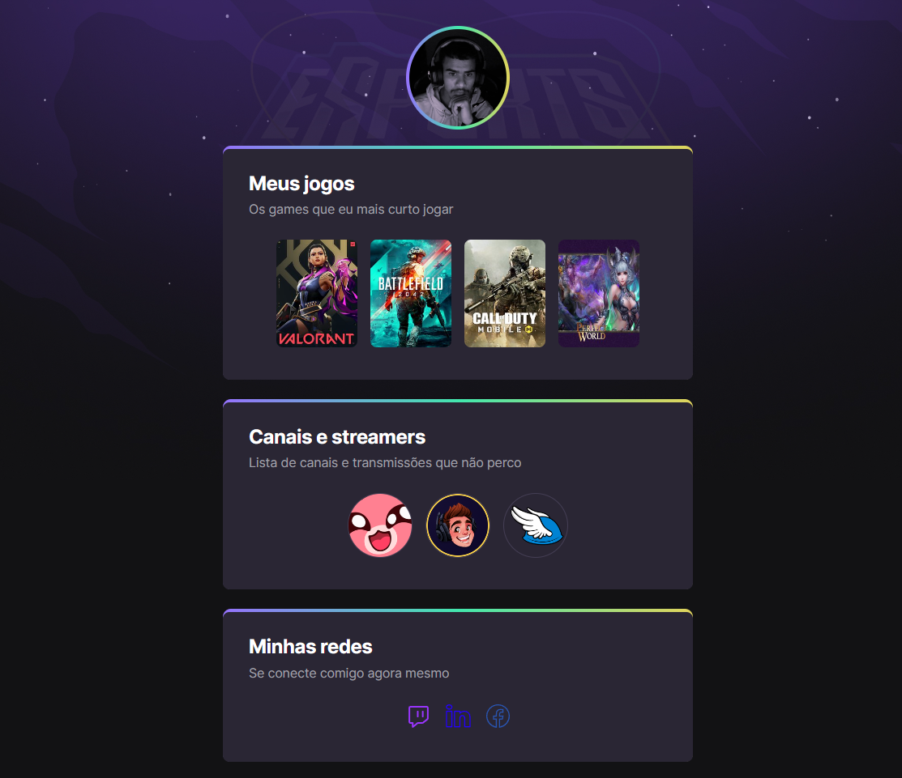

# NLW eSports - Trilha Explorer

### Projeto construido durante o evento Next Level Week da rockeatseat

🔗[clique aqui para acessar](https://zLeggi.github.io/nlw-esports-explorer/)
## 💻 Tecnologias 

- HTML
- CSS
- GIT e GITHUB

### O que eu aprendi

O projeto foi desenvolvido para aprofundar os conhecimentos em HTML e CSS. Foi utilizado as melhores praticas de utilização dessas duas tecnologias.

- No HTML foi apresentado várias tags e a forma semântica de estruturar o documento, utilização correta de classes e IDs e as formas de linkar CSS, Fontes, Scripts, etc.
- No CSS foi apresentado uma otima forma de estruturar seu documento de estilo, boas praticas, animações com CSS.
- Git e GitHub. A pagina foi posta no war por meio do GitHub pages. Foi apresentado como subir seu projeto e as atualizações feitas ao longo do desenvolvimento.